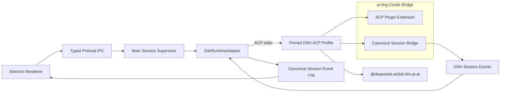

# DSH ACP 接入执行计划

记录时间：2026-09-07
状态：Phase 0、官方 LLM Adapter 与 PR2A 审批对齐已完成；PR2B 待实施
固定 DSH：`dsh-v0.1.3-alpha.1` / `d347e703908d0406b7a7ef80e3a0e594d86b2215`
固定 ACP SDK：`@agentclientprotocol/sdk@1.4.0`

## 1. 目标

pi-ling 继续使用 ACP 作为 Electron Main 与 DSH sidecar 之间的控制协议，
并通过受控的 Cordis Bridge 补齐 DSH 内核与产品统一架构之间的差异。

目标链路：



完成后应满足：

- Native 与 DSH 共用一套产品级 Session Event Log。
- Runtime 切换不创建新的用户可见 Session，且模型上下文连续。
- DSH 保留原生 Resume 所需的 Runtime projection，但不成为产品事实源。
- Assistant text/reasoning 支持真实增量流式传输。
- Tool、Approval、Usage、Changes 和错误具有一致且安全的产品语义。
- DSH 依赖可分发、版本固定，不依赖开发机绝对路径。

## 2. 已确认的技术路线

### 2.1 采用 ACP 加 Cordis Bridge

ACP 负责：

- sidecar 进程边界；
- Session create/list/resume/close；
- Prompt 与单 Session cancel；
- Permission request/response；
- 模型配置与 MCP；
- 标准 Assistant、Reasoning、Tool 和 Context Usage 更新。

Cordis Bridge 负责：

- Canonical Transcript Seed 与增量同步；
- DSH Runtime projection；
- ACP live stream 补充；
- 固定版本 Profile 和分发。

模型调用使用固定 DSH 自带的 `@deepseek-ai/dsh-llm-pi-ai`，Profile 只配置
DeepSeek 与 Anthropic 路由。

### 2.2 不采用的路线

- 不使用官方 DSH SDK 替换 ACP。固定版本 SDK 缺少单 Session cancel、
  Approval、显式 Resume/Close、Canonical Seed 和 live token stream。
- 不把 DSH/Cordis 内核直接嵌入 Electron Renderer 或 Main 的长任务路径。
- 不通过解析交互式 CLI 文本接入 DSH。
- 不追随 DSH `latest` 或当前本地 `master`；升级必须单独评估和迁移。

相关决策依据：

- [Runtime 与统一会话架构决策](runtime-architecture-decision.md)
- [DSH 接入状态与待修问题](dsh-integration-status.md)
- [Canonical Transcript 设计研究](canonical-transcript-design.md)
- [DSH TypeScript SDK Adapter PoC](dsh-sdk-poc.md)
- [Agent 流式传输、会话连续性与执行渲染](agent-streaming-and-run-rendering.md)

## 3. 当前实现基线

### 3.1 已完成

- `DshRuntimeAdapter` 已通过 ACP stdio 接入 Session new/resume/close、
  prompt、cancel、permission 和基础 update。
- Electron Main 已按 feature flag 注册 DSH Runtime。
- `DshAgentSession` 已将基础 DSH 事件写入 `session_events` 并投影到 Timeline。
- 同一个产品 Session 可以在 Native 与 DSH 之间原地切换。
- `runtime_sessions` 和 `runtime_projection_entries` 表已建立。
- `RunMessageBuffer` 已支持按 Session/Run 隔离 transient frame。
- fake ACP 测试已覆盖基础事件、permission round-trip、cancel 和进程 crash。
- 固定 Profile 已启用官方 `@deepseek-ai/dsh-llm-pi-ai` 的 DeepSeek 与
  Anthropic 路由，ACP 默认选择 DeepSeek。
- `@pi-ling/dsh-transcript` 已完成 text-only user/assistant pairs 到
  DSH Session Event Seed 的确定性 PoC。

当前开发环境已使用固定 DSH 进程和本地 mock LLM 重新验证 ACP Prompt、
Cancel、Close、跨进程 Resume 与统一事件落库。历史文档记录的真实 Provider
LLM Bridge 和 Seed recall 仍需分别重新执行后，才能视为当前环境通过。

### 3.2 当前缺口

- Native → DSH 没有消费 Canonical 历史；Runtime 切换只切换 Adapter。
- `lastSyncedCanonicalSeq` 尚无产品级读写流程。
- DSH Assistant 目前只收到 committed message block，不是真实 token delta。
- ACP `usage_update.used/size` 被错误解释成本轮 input/output usage。
- ACP `messageId` 未进入 `RuntimeEvent`，DSH 使用 synthetic message id。
- 一个 ACP Prompt 内的连续 Tool 被拆成多个 synthetic turn。
- DSH `changedFiles()` 返回空数组，`diff()` 返回 `undefined`。
- DSH pending permission 没有像 Native 一样形成完整的 durable recovery 流程。
- Runtime capabilities 中存在尚未由产品实际暴露或验证的能力。

### 3.3 P0 安全问题

固定版本 ACP 的 Permission 请求可能只携带 `toolCallId`，没有可靠的
`toolKind`、命令或文件路径。当前 `auto` 分支可能把未知类型视为
“非破坏性”并自动允许。

必须改为：

```text
缺失或无法解析 effect
  → unknown
  → 所有审批模式均询问
```

任何 Bridge 或 UI 信息不足都不能降低产品安全策略。

### 3.4 本机版本状态

计划建立时，本机 `/Users/guyi/deepseek-harness` 位于
`master / 47f943859bef60e4160492346772ded9b24f765a`，包版本为
`0.1.0-rc.5`，不是本项目固定版本。当前已另建
`/Users/guyi/deepseek-harness-d347e703` 固定 worktree，并由 `.dsh-source`
指向；所有真实验证仍必须记录实际 commit、ACP SDK、Node 和 Profile。

## 4. 插件边界

### 4.1 官方 LLM Adapter：`@deepseek-ai/dsh-llm-pi-ai`

职责：

- 使用上游 pi-ai 完成 DSH Message、Tool、Reasoning、Attachment、Replay、
  Usage 和 Finish 的双向转换。
- 只启用 DeepSeek 与 Anthropic 路由。
- 通过 DSH credentials/environment seam 解析凭据，不接触 Renderer。

非职责：

- 不管理产品 Session Event Log。
- 不决定 Effect Approval。
- 不负责 Native/DSH Runtime 切换。

该插件由固定 DSH 版本提供，pi-ling 不复制或维护其实现。产品只维护
Profile patch、允许的 Provider 配置和真实 ACP Smoke。

### 4.2 自研插件：Canonical Session Bridge

当前原型：`@pi-ling/dsh-transcript`。正式包名在 Seed 接入方案确定后决定，
暂用 `@pi-ling/dsh-session-bridge` 表示。

职责：

- Canonical Message → DSH Session Event/Surface Seed。
- DSH Session Event → Canonical/Runtime projection 所需的稳定映射。
- 支持 User、Assistant、Reasoning、Tool Call、Tool Result、Attachment、
  Usage 和 Compaction。
- 保留稳定 message/tool identity 与 Runtime 私有 raw payload。
- 维护 `lastSyncedCanonicalSeq`，支持幂等增量同步。
- 为 DSH 原生 Resume 保存可重建 projection。

非职责：

- 不把 DSH 原生 Transcript 变成产品权威事实源。
- 不直接渲染 UI。
- 不绕过 ACP Session 生命周期或产品 Approval Policy。
- 不承诺不同 Runtime 的所有私有字段都能无损互转。

产品化要求：

- 导入后 `session.deriveMessages()` 必须与期望 Canonical 模型视图一致。
- 同一批 Seed 重放不得产生重复消息或重复 Tool。
- 删除 Runtime projection 后，产品 Canonical 历史仍完整可读。
- 无法无损表达的字段必须保存在 `rawPayload.dsh` 或明确降级。

### 4.3 ACP Plugin Extension

live stream 需要扩展固定版本 ACP Plugin，而不是新增第三套产品事实模型。

职责：

- 监听 DSH `agent/assistant-stream`。
- 将 text/reasoning delta 映射到标准 ACP chunk。
- 传播真实 `messageId`。
- 保持 Tool 和 committed message 的 ACP 标准语义。

该扩展属于固定版本 Profile 的受控补丁，不计作独立产品插件，也不得扩大为
通用第三方插件 API。

## 5. 阻塞性设计决策：Canonical Seed 如何穿过 ACP

DSH 内核支持 `agents.create({ seed })`，但固定版本标准 ACP
`session/new` 不接受 history。正式实现前必须完成一个隔离 Spike，只比较
以下两种方案。

### 方案 A：最小 `session/import` 扩展

在固定 ACP Profile 中增加 pi-ling 专用请求：

```text
piLing/session/import
  → validate canonical payload/version
  → create DSH Session Event seed
  → create or persist inactive session
  → return external session id and imported watermark
```

优点：

- 生命周期和失败边界清晰；
- Main 能获得明确导入结果和水位；
- 不需要直接写 DSH 私有持久化文件。

风险：

- 不再是纯标准 ACP；
- 需要维护自定义 schema、版本协商和契约测试；
- 固定 ACP Plugin 升级时需要重放补丁。

### 方案 B：SessionPersistence 预物化后 Resume

Bridge 将 Canonical 历史预先物化为 DSH persistence，再通过标准
`session/resume` 打开。

优点：

- 外部控制面继续使用标准 ACP；
- Resume 与正常 DSH 持久化走同一条路径。

风险：

- 需要明确谁拥有 DSH persistence 的写入权；
- 必须避免 Main 与 sidecar 并发写同一 Session；
- 对 DSH persistence format 的耦合可能高于最小 RPC 扩展；
- 导入失败、水位提交和原子性更复杂。

### 决策标准

Spike 必须给出：

- 原子性和重复调用行为；
- 进程 crash 后的一致性；
- 多 Session 隔离；
- schema/version 升级成本；
- 是否需要 Main 直接写 DSH 私有文件；
- 是否支持 Tool/Reasoning/Attachment；
- 实际代码量和测试量；
- 固定版本升级时的补丁维护面。

未完成该 Spike 和评审前，不进入正式 Canonical Session Bridge 接线。

## 6. 实施阶段

### Phase 0：建立可复现固定基线

目标：在当前开发机上得到与产品声明一致的 DSH 环境。

工作：

- 为固定 tag 准备独立 checkout/worktree，不覆盖当前 DSH `master`。
- 验证 Node、pnpm、DSH CLI 和 ACP SDK 版本。
- 将本地路径改为环境配置或开发脚本输入。
- 确认正式包与测试不依赖 `E:/...`。
- 重新执行真实 ACP create/prompt/cancel/close/resume Smoke。
- 记录固定 Profile 的有效配置和启动命令。

主要影响：

- [`.env.example`](../.env.example)
- [`packages/dsh-runtime/README.md`](../packages/dsh-runtime/README.md)
- [`apps/desktop/src/main/index.ts`](../apps/desktop/src/main/index.ts)
- [`apps/desktop/src/main/dsh-unified-smoke.test.ts`](../apps/desktop/src/main/dsh-unified-smoke.test.ts)
- DSH PoC 包的 manifests 与真实测试

验收：

- 新环境能明确启动固定 commit，而不是当前 `master`。
- Smoke 能验证 Session create/prompt/cancel/close/resume。
- 测试输出记录实际 DSH commit 和 Profile。
- 仓库中没有新增开发机绝对路径。

不做：

- 不升级 DSH 版本。
- 不在本阶段实现 Canonical Seed 或 live stream。

### Phase 1：修正安全与 Runtime/Event 合约

目标：先让现有 ACP 接入语义正确、安全且可测试。

PR2A 审批行为对齐已完成：

- Native 与 DSH 共用 Effect/`approvalReason` 产品规则，各自保留门控实现。
- DSH 通过内置 `tools/pre-execute` 模块调用官方 `dsh-user-approval` 与 ACP。
- unknown/missing、敏感写入和破坏性命令在所有模式下强制询问。
- `manual`、`accept-write`、`auto` 的确定性行为矩阵与真实 DSH 写入审批
  Smoke 已通过。

PR2B 已完成：

- 将 `usage_update` 表达为 `contextUsage { used, size }`。
- 不再伪造 DSH per-turn input/output usage。
- 在 Runtime Event 中传递 ACP `messageId`。
- 为一个 ACP Prompt 定义稳定的 `executionGroupId`（`${runId}:exec`）。
- 核对并收紧 DSH Runtime capabilities。
- 验证 `session/close` 后使用原 external id `session/resume` 的行为。

主要影响：

- [`packages/runtime-contracts/src/index.ts`](../packages/runtime-contracts/src/index.ts)
- [`packages/dsh-runtime/src/dsh-runtime.ts`](../packages/dsh-runtime/src/dsh-runtime.ts)
- [`packages/dsh-runtime/test/dsh-runtime.test.ts`](../packages/dsh-runtime/test/dsh-runtime.test.ts)
- [`apps/desktop/src/main/dsh-agent-session.ts`](../apps/desktop/src/main/dsh-agent-session.ts)
- [`apps/desktop/src/main/dsh-agent-session.test.ts`](../apps/desktop/src/main/dsh-agent-session.test.ts)
- [`packages/contracts/src/index.ts`](../packages/contracts/src/index.ts)

验收：

- 缺少 `toolKind` 的真实形态不会自动允许（已完成）。
- Context Usage 在协议、持久化和 UI 中含义一致。
- committed message 使用 ACP 提供的 identity。
- capability 每一项都有代码和测试证据。

不做：

- 不在本阶段改变 Session Seed 方案。
- 不增加 DSH 原生 UI surfaces。

### Phase 2：采用官方 LLM Adapter

状态：已完成。

结果：

- 固定 ACP Profile 使用 DSH 自带的 `@deepseek-ai/dsh-llm-pi-ai`。
- 只配置 DeepSeek 与 Anthropic 路由，ACP 默认选择
  `deepseek/deepseek-v4-flash`。
- Profile patch 写入版本化 `DSH_HOME` 并通过 `--patch` 加载。
- 真实 DSH ACP 进程与本地 mock Provider 已验证 Prompt、Cancel、Close、
  跨进程 Resume 和 Canonical Event 落库。
- 删除自研 `@pi-ling/dsh-llm` 与 `@pi-ling/ai`，不再维护重复模型协议。

主要影响：

- [`apps/desktop/src/main/dsh-pi-ai-profile.ts`](../apps/desktop/src/main/dsh-pi-ai-profile.ts)
- [`apps/desktop/src/main/dsh-launch-config.ts`](../apps/desktop/src/main/dsh-launch-config.ts)
- [`packages/dsh-runtime/src/dsh-runtime.ts`](../packages/dsh-runtime/src/dsh-runtime.ts)
- 固定 DSH 自带的 `@deepseek-ai/dsh-llm-pi-ai`

后续真实 Provider 验证按凭据条件显式启用，不阻塞默认确定性测试。

### Phase 3：Canonical Session Bridge 与上下文同步

目标：打通产品 Canonical 历史与 DSH 模型上下文。

工作：

- 先完成 Seed 穿过 ACP 的阻塞性 Spike 和评审。
- 将 text-only PoC 扩展到完整 Canonical 内容。
- 建立 Canonical seq 与 DSH projection 水位。
- 新 DSH Session 导入完整缺失历史。
- 已存在 DSH Session 只同步 `lastSyncedCanonicalSeq` 之后的 delta。
- 保持 Tool Call/Result 配对、Message ID 和 Compaction Surface。
- 为失败导入、重复导入和中途 crash 建立幂等语义。

主要影响：

- [`packages/dsh-transcript/src/index.ts`](../packages/dsh-transcript/src/index.ts)
- [`packages/dsh-transcript/test/seed.test.ts`](../packages/dsh-transcript/test/seed.test.ts)
- [`apps/desktop/src/main/session-store/session-store.ts`](../apps/desktop/src/main/session-store/session-store.ts)
- [`apps/desktop/src/main/session-supervisor.ts`](../apps/desktop/src/main/session-supervisor.ts)
- [`apps/desktop/src/main/dsh-agent-session.ts`](../apps/desktop/src/main/dsh-agent-session.ts)

验收：

- Native 对话切到 DSH 后能正确引用之前历史。
- 含 Tool/Reasoning 的历史导入后 `deriveMessages()` 正确。
- 相同水位重复激活不会产生重复消息或工具执行。
- 导入提交失败时保留原 Runtime 和原水位。
- DSH 原生 Resume 与产品 Canonical 历史不会形成两个事实源。

不做：

- 不宣称所有 Provider 私有 replay state 可跨 Runtime 无损转换。
- 不在运行中的 Tool/Turn 中途切换 Runtime。

### Phase 4：ACP live stream

目标：将 DSH 内部真实生成流映射到产品 transient frame。

工作：

- 扩展固定 ACP Plugin，监听 `agent/assistant-stream`。
- 输出标准 `agent_message_chunk` 与 `agent_thought_chunk`。
- 传递真实 `messageId`，必要时传递 Tool argument delta。
- Main 按 `sessionId + runId + messageId` 合并 frame。
- committed Assistant Message 落库后清除对应 Buffer。
- 处理 live/committed 去重、取消 partial、断线、背压和顺序。

主要影响：

- 固定 DSH ACP Plugin 补丁
- [`packages/dsh-runtime/src/dsh-runtime.ts`](../packages/dsh-runtime/src/dsh-runtime.ts)
- [`apps/desktop/src/main/run-message-buffer.ts`](../apps/desktop/src/main/run-message-buffer.ts)
- [`packages/session-events/src/index.ts`](../packages/session-events/src/index.ts)
- Renderer presentation tests

验收：

- 真实模型生成期间可观察多个 delta，而不是提交后一次整段出现。
- 完整消息只持久化一次。
- reconnect snapshot + buffer 不重复文本。
- cancel 后 partial 不会被错误提交成完整回答。
- Tool、Reasoning 和正文顺序稳定。

不做：

- 不逐 token 写 SQLite。
- 不将 presentation queue 变成事实源。

### Phase 5：产品统一会话与 DSH 体验

目标：让 DSH 在产品层表现为统一 Runtime，而不是独立 Demo。

工作：

- Runtime 只在 durable Turn boundary 切换。
- Native → DSH 执行 Seed/delta sync 后再发送 Prompt。
- DSH → Native 从 Canonical Session Event Log 恢复。
- 切回 DSH 时恢复原 external session，不创建新的 UI Session。
- Runtime 切换失败时回滚原 Runtime、projection 和状态。
- 一个 ACP Prompt 聚合为一个 Run Activity execution group。
- 使用 Tool kind/raw input/raw output 生成可读摘要。
- 为 DSH 接入 workspace changes/diff。
- 将 DSH approval 请求纳入 durable pending/recovery 流程。

主要影响：

- [`apps/desktop/src/main/session-supervisor.ts`](../apps/desktop/src/main/session-supervisor.ts)
- [`apps/desktop/src/main/dsh-agent-session.ts`](../apps/desktop/src/main/dsh-agent-session.ts)
- [`apps/desktop/src/main/session-store/session-store.ts`](../apps/desktop/src/main/session-store/session-store.ts)
- [`apps/desktop/src/renderer/src/run-activity/project-run-activity.ts`](../apps/desktop/src/renderer/src/run-activity/project-run-activity.ts)
- [`apps/desktop/src/renderer/src/features/chat/RunActivityBlock.tsx`](../apps/desktop/src/renderer/src/features/chat/RunActivityBlock.tsx)

验收：

- Native/DSH 往返切换保持同一用户可见 Session 和连续上下文。
- 后台 DSH Run 不受当前选中页面影响。
- 同一 Run 的连续 Tool 不再产生多段碎片化“执行过程”。
- DSH Changes/Diff 与 Native 使用一致的工作区安全边界。
- pending approval 在切换页面和应用重启后仍可正确处理。

不做：

- 不渲染 DSH 原生 plans、terminal 或 elicitation UI。
- 不允许同一 Workspace 多个活跃 Session 并发写入。

### Phase 6：恢复矩阵、Eval 与分发

目标：完成可发布的稳定性和可升级性验证。

工作：

- 覆盖 sidecar crash、Main crash、应用退出和系统取消。
- 覆盖 awaiting approval、approved pending exec、executing tool 和
  committed result 等恢复边界。
- 确保已有 durable Tool Result 的 callId 不会再次执行。
- 覆盖多 Session、多 Workspace、后台 Run 和快速切换。
- 建立 Native/DSH 黑盒 Coding Eval 对照。
- 固定 Bridge 包、Profile、许可证清单和版本化 `DSH_HOME`。
- 定义 Bridge/Projection schema migration 与回滚。
- 保留首次启用安全确认和 developer preview 标识。

主要影响：

- DSH/Session Supervisor integration tests
- opt-in real DSH smoke tests
- packaging/profile scripts
- [`THIRD_PARTY_NOTICES.md`](../THIRD_PARTY_NOTICES.md)
- Eval harness（新增位置在实现前确认）

验收：

- 恢复矩阵中的每个状态都有确定性测试。
- 真实 DSH Smoke 覆盖 Prompt、Tool、Cancel、Permission、Resume 和
  Native/DSH handoff。
- 安装产物不依赖源码 checkout。
- 固定版本升级失败可安全回滚。
- Eval 能比较两个 Runtime 的任务完成、Diff、重复副作用和恢复结果。

## 7. 测试策略

### 7.1 确定性测试

每个 PR 必须优先使用 fake ACP、内存事件和临时 SQLite 验证：

- Runtime Event 映射；
- Session identity 与 sequence；
- Permission Policy；
- Seed/Projection 幂等；
- Buffer 去重；
- Runtime switch rollback；
- crash recovery；
- Tool 不重复执行。

确定性测试不得依赖模型凭据、固定本机路径或外部网络。

### 7.2 真实 Smoke Test

真实测试必须显式 opt-in，并打印非敏感环境元数据：

- DSH commit；
- ACP SDK version；
- Profile version；
- Provider/model；
- Node version；
- 测试场景名称。

禁止打印 API Key、完整凭据环境或敏感工作区内容。

真实矩阵至少包括：

1. ACP create → prompt → committed answer；
2. prompt → cancel；
3. close → process restart → resume；
4. permission allow/reject；
5. Native history → DSH Seed → recall；
6. DSH live stream → committed dedupe；
7. Tool execution → Changes/Diff；
8. sidecar crash → product recovery。

### 7.3 提交门禁

每个阶段完成时运行项目已有：

```text
pnpm typecheck
pnpm test
pnpm build
```

DSH 固定接口、Bridge package 和真实 Smoke 使用独立显式命令，不能让默认
测试在缺少 DSH 或凭据时失败。

## 8. 建议 PR 拆分

- [x] PR1：固定版本开发环境、跨平台路径和真实 ACP 基线 Smoke。
- [x] PR2A：Native/DSH 三档审批行为、unknown fail-closed 与真实写入 Smoke。
- [x] PR2B：contextUsage、messageId、execution group 和 truthful capabilities。
- [x] PR3：采用固定 DSH 官方 `dsh-llm-pi-ai` 并完成 Profile Smoke。
- [x] PR4：Canonical Seed 接入 Spike，记录 import 与 persistence 决策。
- [x] PR5：Canonical Session Bridge text/tool/reasoning MVP 与幂等水位。
- [ ] PR6：Attachment、Compaction、Runtime projection 与跨 Runtime handoff。（跨 Runtime handoff 增量 delta 同步已完成；Attachment/Compaction 待有真实数据流）
- [ ] PR7：ACP live stream、Main Buffer 去重与取消语义。
- [ ] PR8：稳定 Run Activity、Tool 摘要、durable Approval 和 Changes/Diff。
- [ ] PR9：恢复矩阵、真实 Smoke、Eval、分发和升级回滚。

拆分原则：

- 每个 PR 只解决一个可独立验收的问题。
- 公共协议变化必须同步检查 Main、Preload、Renderer 和 Runtime。
- 安全修复不得等待 UX 或插件打包 PR。
- Spike 只产出可复现实验、决策和删除计划，不长期保留并行实现。

## 9. 当前状态清单

已完成并有当前代码证据：

- [x] ACP RuntimeAdapter 基础实现。
- [x] fake ACP event/permission/cancel/crash 测试。
- [x] Electron Main DSH feature flag 与 Session wiring。
- [x] DSH 事件写入统一 `session_events` 的基础路径。
- [x] 官方 `dsh-llm-pi-ai` Profile 接入。
- [x] text-only Canonical Seed 确定性 PoC。
- [x] SDK、ACP、Canonical Transcript 和 Runtime 架构研究。

当前环境已重新验证：

- [x] 固定 commit 的真实 ACP Prompt/Cancel/Close/Resume Smoke。
- [x] 固定 DSH 事件进入产品 Canonical Session Event Log。
- [x] 官方 `dsh-llm-pi-ai` 通过本地 mock Provider 的真实 ACP Smoke。
- [x] 真实 DSH 写工具经过官方审批链并在允许后继续执行。

尚待当前环境重新验证：

- [ ] 官方 LLM Adapter 的真实 DeepSeek/Anthropic Provider 调用。
- [ ] Seed 后真实模型 recall。
- [ ] 真实 ACP Permission。

尚未实现：

- [x] 正确 contextUsage。
- [x] ACP message identity。
- [x] Stable execution group。
- [ ] 完整 Canonical Session Bridge。
- [x] Seed 产品接线（首次完整导入 + 幂等水位）。
- [x] Seed 增量水位（已存在 session 的 delta 同步）。
- [ ] live token stream。
- [ ] DSH Changes/Diff。
- [ ] DSH durable approval recovery。
- [ ] 完整跨 Runtime 和 crash Eval。

## 10. 明确不做

本计划范围内不做：

- Claude Runtime Adapter；
- 通用 extension API、插件市场或第三方动态加载；
- DSH SDK 正式接入；
- DSH `latest` 自动升级；
- DSH 原生完整 UI 的复制；
- Renderer 直接持有凭据、执行命令或访问文件系统；
- 用模型摘要冒充无损 Canonical Seed；
- 为展示动画逐 token 持久化；
- 与 DSH 接入无关的工作台视觉扩展。

## 11. Definition of Done

DSH ACP 接入只有同时满足以下条件才视为完成：

- 固定 DSH/ACP/Node/Profile 能从干净环境复现。
- Bridge 产物不依赖源码 checkout 和绝对路径。
- 三档审批模式与 unknown/destructive effect 安全策略一致。
- Native 与 DSH 往返切换保持同一 Session 和连续上下文。
- DSH live delta、committed message 和 reconnect 不重复内容。
- Tool、Reasoning、Usage、Approval 和 Changes 具有正确产品语义。
- close/restart/resume、cancel 和 crash 不重复已完成副作用。
- Canonical Event Log 始终是唯一产品事实源。
- 确定性测试、真实 Smoke、类型检查和构建全部通过。
- 固定版本升级与失败回滚路径有文档和测试。
