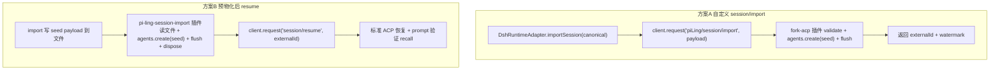

# Canonical Seed 接入 Spike 决策记录

记录时间：2026-09-07
固定 DSH commit：`d347e703908d0406b7a7ef80e3a0e594d86b2215`（`0.1.3-alpha.1`）
结论：**采用方案 B（SessionPersistence 预物化后 Resume）**，作为 PR5 的起点。

## 1. 目标与结论

pi-ling 需要把 Canonical 历史（Session Event Log 投影出的 message 序列）注入
固定版 DSH 的模型上下文。DSH 内核支持 `agents.create({ seed })`，但标准 ACP 的
`session/new` 不接受 history。本 Spike 比较两条把 seed 穿过 ACP 的路径：

- **方案 A**：fork 官方 acp 插件，新增自定义 `piLing/session/import` method。
- **方案 B**：预物化 seed 到 DSH persistence，再用标准 `session/resume` 打开。

**结论：方案 B 胜出**。理由见第 4 节逐项对比。方案 A 未实施（静态评估），
避免了引入 1825 行 fork 的维护负担。

## 2. 已验证事实（代码证据）

- `AgentRegistry.create(options)` 接受 `CreateAgentOptions.seed`（seq 0 连续、
  lossless、无 open turn/step），`meta.isSeeded` 仅标记 fork 继承前缀。
  [packages/core/agent/src/index.ts](../.dsh-source/packages/core/agent/src/index.ts)
- `SessionHandle.close()` 只释放句柄并完成 pending durability，**不删除**已落盘的
  事件日志；`flush()` 是 crash 存活屏障。
  [packages/session/session-persistence/src/handle.ts](../.dsh-source/packages/session/session-persistence/src/handle.ts)
- `session/resume` 的资格校验只看 `origin!=='subagent'`、无 parentSession、cwd 匹配，
  不看 `meta.isSeeded`。预物化的 seed session 可被标准 resume 直接打开。
  [packages/acp/acp/src/index.ts](../.dsh-source/packages/acp/acp/src/index.ts)
- 标准 ACP 无「带 history 建会话」method；`session/load` 只接受
  `sessionId/cwd/mcpServers`。ACP SDK 的 `request(method: string, ...)` /
  `onRequest(method: string, ...)` 支持任意字符串 method，但 ACP server 的 method
  注册发生在官方 acp 插件的 `apply()` 闭包内，外部插件无法追加 handler，
  因此方案 A 必须 fork。
- 官方 acp 插件规模：1825 行 / 7 文件，依赖 7 个 DSH workspace peer 包
  （`dsh-agent`、`dsh-llm`、`dsh-mcp-client`、`dsh-attachment`、`dsh-session`、
  `dsh-session-persistence`、`dsh-user-approval`）。
- 方案 B 已通过真实 DSH 进程 + mock LLM 验证（`RUN_REAL_DSH_SEED_SPIKE=1`）：
  `pre-materialize seed → flush → dispose → session/resume → recall ORANGE-42`。

## 3. 两条路径



两条路径在 DSH sidecar 内部做的事完全相同（`agents.create({ seed })` +
`sessions.flush` + `handle.dispose()`）；唯一差异是 seed 的运输通道（自定义 RPC
vs 文件 side-channel）与 Main/sidecar 握手方式。

## 4. 8 项决策标准逐项对比

| 标准 | 方案 A（fork + RPC） | 方案 B（预物化 + resume） |
| --- | --- | --- |
| 原子性 / 重复调用 | RPC request/response 天然握手；重复 import 需自己处理幂等 | 文件 + doneFile 握手（已实现）；重复 import 同一 id 会因 registry/persistence 冲突报错，可重试 |
| crash 一致性 | flush 前 crash 则 session 未物化，RPC 返回错误给 Main | 同左；flush 后 doneFile 落盘，Main 侧可据此判断 |
| 多 Session 隔离 | 每个 import 独立 sessionId，天然隔离 | 同左（每个 payload 独立 sessionId） |
| schema/version 升级 | 自定义 payload schema 需版本协商，DSH 升级时要重放 fork 的 method | payload 是 JSON 文件，seed 走 DSH 自身 `SESSION_FORMAT_VERSION` 校验，不新增协议版本 |
| Main 是否直写 DSH 私有文件 | 否（RPC 让 sidecar 内部 create/flush） | 否（Main 只写 payload 文件，persistence 写入由 DSH 自身 API 完成） |
| Tool/Reasoning/Attachment 支持 | 依赖 `toDshSeed` 投影能力，两条路径相同 | 同左；本 Spike 仅 text-only |
| 代码量 / 测试量 | 需 fork 1825 行 + 改 session.ts 支持 seed + method handler + 测试 | 新增 ~90 行插件 + ~150 行测试，已通过 |
| 补丁维护面 | patch 替换官方 acp entry 的 `name` 指向 fork，每次 DSH 升级 diff 官方 vs fork | patch 只 `insert` 独立插件，不动官方 acp entry，升级只需重验 seed 形状 |

## 5. 推荐与理由

**推荐方案 B**，理由：

1. 控制面继续使用标准 ACP（`session/resume`），不引入私有 method。
2. 补丁维护面最小：只在 profile 里 `insert` 一个独立插件，官方 acp 零改动。
3. 代码量最小，且已通过真实 DSH 验证 recall。

方案 A 的唯一优势是 RPC 握手比文件 side-channel 更"干净"，但代价是 1825 行
fork + 每次 DSH 升级重放补丁，不成比例。

方案 B 的已知弱点（需在 PR5 正视）：

- 文件 side-channel 的握手是 `doneFile` 协议，PR5 需要换成更正式的机制
  （DSH_HOME 下版本化目录、或进程内 `session/import` 服务的持久化触发）；
- Main 与 sidecar 的并发写边界要在 PR5 明确（当前用 doneFile 串行化）。

## 6. 删除计划与 PR5 起点

- **保留**：[packages/dsh-transcript/src/dsh-session-import.ts](../packages/dsh-transcript/src/dsh-session-import.ts)
  作为方案 B 的插件原型，PR5 演进为正式 Bridge（改 doneFile 握手为产品级协议）。
- **保留**：[packages/dsh-transcript/test/seed-spike.test.ts](../packages/dsh-transcript/test/seed-spike.test.ts)
  作为可回归的 seed recall 验证，PR5 加入 Tool/Reasoning 后扩展。
- **方案 A 无删除物**：未 fork 官方 acp，无临时代码需清理。
- PR5 起点：以方案 B 为基础，扩展 `toDshSeed` 覆盖 Tool/Reasoning/Attachment，
  并把 side-channel 握手替换为产品级持久化接线。

## 7. 验证命令

```sh
# 默认测试（不启动 DSH，seed 投影单元测试）
pnpm --filter @pi-ling/dsh-transcript test

# 真实 DSH seed recall（启动 DSH 子进程 + mock LLM）
pnpm --filter @pi-ling/dsh-transcript build
RUN_REAL_DSH_SEED_SPIKE=1 pnpm --filter @pi-ling/dsh-transcript test
```
